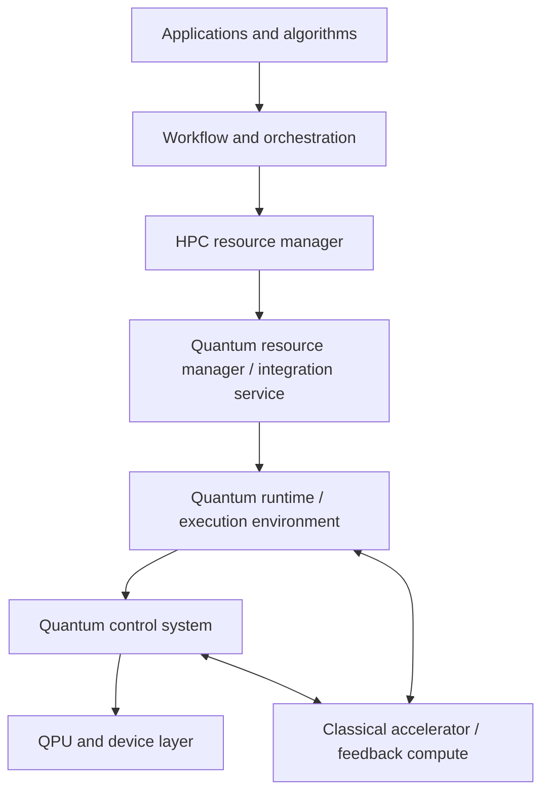

# Meeting 1 — Scope and Charter

**Meeting type:** Decision gate  
**Milestone:** Landscape & Requirements v0.1  
**Target:** SC26-ready release by November 13, 2026

## Purpose

Agree on the problem space that the OpenQSE Quantum Control Working Group will characterize in Milestone 1—independent of any current partner, vendor, or reference implementation.

The existing OpenQSE SC26 architecture will be used as a validation case after the broader scope is defined. It does not define the scope.

## Decisions required today

By the end of the meeting, the group should decide:

1. What is in scope and explicitly out of scope for Milestone 1?
2. Which use-case classes will drive the analysis?
3. Is the straw-man functional architecture a sufficient starting point?
4. Which interface boundaries are primary, adjacent, or context-only for this working group?
5. Who owns the first use-case, architecture, and landscape contributions?

Items that cannot be resolved today will be recorded as open questions with an owner and deadline. The group is approving a starting baseline, not a final standard.

## Agenda

| Time | Topic | Discussion | Output |
|---:|---|---|---|
| 0:00–0:05 | Opening and desired decisions | Framing | Shared objective and decision rules |
| 0:05–0:15 | Milestone 1 scope | Review scope straw man; discuss only proposed changes | Provisional in/out-of-scope boundary |
| 0:15–0:28 | Use-case prioritization | Validate, merge, and rank tentative use cases | Five to seven use-case classes |
| 0:28–0:40 | Functional architecture | Walk through logical roles and missing functions | Accepted architecture baseline or named revisions |
| 0:40–0:52 | Interface taxonomy | Classify interfaces as primary, adjacent, or context | Initial interface register and work priorities |
| 0:52–0:58 | SC26 relationship and v0.1 contents | Confirm reference-architecture role | SC26 mapping principle and v0.1 package |
| 0:58–1:00 | Owners and deadlines | Read back decisions and assignments | Named owners and due dates |

---

## 1. Proposed scope

### Scope statement

> Milestone 1 will characterize the functional roles, interfaces, information flows, timing regimes, and interoperability requirements that connect HPC resources and quantum execution/control systems for scalable hybrid HPC–QC operation. It will survey existing approaches, identify gaps, and prioritize candidate boundaries for later OpenQSE specification and validation work.

### In scope

- Functional boundaries from HPC scheduling and quantum resource management through quantum runtime, control, and feedback.
- Batch, workflow, co-scheduled, near-time, and deterministic real-time integration regimes.
- Resource and capability discovery, allocation, configuration, execution, status, cancellation, and release.
- Control-plane and data-plane interactions, including measurement streams, parameter updates, telemetry, and error reporting.
- Requirements for latency, jitter, bandwidth, synchronization, determinism, availability, security, isolation, and scale.
- CPU/GPU/FPGA/other classical accelerator interaction with the quantum runtime or control system.
- Existing standards, protocols, APIs, open-source systems, and vendor approaches relevant to these boundaries.
- Mapping of one or more implementations—including the SC26 architecture—onto the vendor-independent functional model.

### Out of scope for Milestone 1

- Selecting or endorsing a preferred vendor, product, scheduler, workflow engine, or transport.
- Treating the present SC26 partner stack as the complete OpenQSE architecture.
- Producing a normative interface specification; that belongs to later milestones.
- Standardizing quantum programming languages, circuit semantics, or algorithm APIs except where boundary requirements depend on them.
- Standardizing internal vendor compiler, pulse-scheduling, firmware, or device-control implementation details.
- Defining device-specific analog/RF electrical interfaces or qubit-physics requirements.
- Publishing comparative vendor rankings or uncontextualized performance claims.
- Requiring precise numerical values where evidence is not yet available.

### Scope questions for the group

1. Does the working group own the full path from the HPC resource manager to the QPU, or primarily the runtime/control and feedback boundaries?
2. Should batch and workflow-level use cases remain in scope as context, even if another OpenQSE group owns their interfaces?
3. Is the control-system-to-QPU boundary part of this landscape, or should it be treated as an external/device-specific boundary?
4. Should multi-QPU and distributed quantum systems be a first-class use case now, or a scalability dimension applied to all use cases?
5. At which boundaries do security, tenancy, provenance, and observability need explicit treatment in v0.1?
6. What terminology needs alignment with other OpenQSE groups before the interface IDs are frozen?

---

## 2. Tentative use cases

The use cases are requirement drivers, not commitments that OpenQSE will standardize every interface they touch.

| ID | Use-case class | Short scenario | Timing regime | Proposed relevance |
|---|---|---|---|---|
| UC-01 | Remote or batch quantum execution | An HPC job submits work to a quantum resource and later retrieves status and results | Loose / asynchronous | Context |
| UC-02 | Workflow-level hybrid execution | A workflow coordinates dependent CPU, GPU, and QPU tasks with data exchange | Loose to near-time | Adjacent |
| UC-03 | Co-scheduled HPC–QPU execution | CPU/GPU/QPU resources and network paths are reserved together for one hybrid job | Scheduling-sensitive | Primary |
| UC-04 | Iterative calibration and adaptive execution | Measurement results drive parameter updates or subsequent executions within a session | Near-time | Primary |
| UC-05 | Deterministic classical-to-control interaction | Classical compute exchanges data or commands with control hardware under bounded timing | Real-time | Primary |
| UC-06 | QEC decoding and fast feedback | Measurements stream to a decoder and corrections or frame updates return before a deadline | Hard real-time / streaming | Primary |
| UC-07 | Multi-QPU or distributed execution | A workflow coordinates multiple QPUs or control domains with topology and synchronization constraints | Mixed | Discussion needed |

### Prioritization questions

- Does each use case impose a meaningfully different set of interface requirements?
- Are calibration and adaptive algorithms one class or two?
- Is multi-QPU execution a separate use case or a scale/topology attribute?
- Which use cases must be represented in the SC26 v0.1 document even if they are not demonstrated?
- Are any important scenarios missing, such as sensing, networking, digital twins, or real-time experiment steering?

### Proposed acceptance test

Retain a use case if it either:

1. introduces a distinct timing, data movement, scheduling, synchronization, security, or scale requirement; or
2. exposes an interoperability boundary that would otherwise be missed.

---

## 3. Straw-man functional architecture

This model describes logical roles. A product or project may combine several roles, and a role may be distributed across several systems.

### Cross-cutting concerns

The following apply across multiple layers rather than forming a single vertical layer:

- identity, authorization, tenancy, and isolation;
- capability discovery and topology description;
- time distribution and synchronization;
- observability, provenance, logging, and error reporting;
- lifecycle, health, and configuration management; and
- portability, versioning, and compatibility negotiation.

### Architecture questions

1. Is a quantum resource manager distinct from the quantum runtime, or is that separation implementation-dependent?
2. Should classical feedback compute be shown as one logical role or as CPU/GPU/FPGA variants?
3. Does a separate data movement or event-streaming service need to be explicit?
4. Where does session management live?
5. Which control functions must remain local to the control system, and which may be exposed upward?
6. Are time synchronization and observability cross-cutting concerns or explicit services?

---

## 4. Initial interface register

The IDs are provisional until Meeting 2. “Primary” means the Quantum Control WG should directly characterize the interface. “Adjacent” means coordination with another OpenQSE activity may be needed. “Context” means the interface is needed to understand end-to-end use cases but is unlikely to be specified by this group.

| ID | Boundary | Example information exchanged | Initial classification | Key questions |
|---|---|---|---|---|
| IF-A | Application ↔ Workflow/orchestration | Workflow graph, tasks, dependencies, result references | Context | What quantum-resource semantics must applications express? |
| IF-B | Workflow/orchestration ↔ HPC resource manager | Job request, dependencies, placement, status | Adjacent | How are hybrid resources requested and dependencies represented? |
| IF-C | HPC resource manager ↔ Quantum resource manager | Discover, allocate, reserve, start, stop, status, release | Primary/adjacent | How is a QPU represented, co-allocated, isolated, and monitored? |
| IF-D | Quantum resource manager ↔ Quantum runtime | Capabilities, sessions, executable submission, lifecycle, errors | Primary | What vendor-neutral lifecycle and capability model is required? |
| IF-E | Quantum runtime ↔ Control system | Programs, configurations, parameters, triggers, results, telemetry | Primary | What must be portable, streamed, versioned, or deterministic? |
| IF-F | Classical accelerator ↔ Quantum runtime | Batched data, kernels, parameters, measurement products | Primary | Which near-time paths and data representations are required? |
| IF-G | Classical accelerator ↔ Control system | Measurement stream, decoder input/output, corrections, triggers | Primary | What latency, jitter, transport, synchronization, and failure semantics apply? |
| IF-H | Control system ↔ QPU/device layer | Analog/digital I/O, triggers, clocking, device responses | Landscape only / discuss | Which aspects are interoperable versus device-specific? |
| IF-I | Telemetry/observability across layers | Health, metrics, traces, provenance, alarms | Cross-cutting | What minimum observability and error model is needed end to end? |
| IF-J | Time and synchronization across layers | Clock source, timestamps, phase/time alignment, deadlines | Cross-cutting | Which components share time, and with what accuracy and holdover? |

### Interface characterization fields

Each retained interface will later be described using:

- purpose and endpoints;
- operations and state transitions;
- control-plane and data-plane flows;
- data model and versioning;
- latency, jitter, bandwidth, determinism, and synchronization;
- resource scale, topology, and concurrency;
- security, isolation, failure, and recovery semantics;
- existing implementations or standards; and
- evidence, gaps, and open questions.

---

## 5. Relationship to the SC26 reference architecture

Proposed decision:

> The OpenQSE SC26 reference architecture is one concrete implementation and validation vehicle. It will be mapped onto the logical roles and interfaces defined by this working group, but it will neither constrain the landscape nor define the standard.

For v0.1, each interface should be labeled as:

- **Demonstrated at SC26**;
- **Partially exercised at SC26**;
- **Architecturally represented but not exercised**; or
- **Outside the SC26 implementation**.

The last category is a finding, not a failure.

---

## 6. Meeting outputs and assignments

| Decision or task | Owner | Deliverable | Due |
|---|---|---|---|
| Publish agreed scope and open questions | TBD | Updated scope section and decision record | Oct 2 |
| Finalize use-case cards | TBD by use case | One completed card per retained use case | Oct 7 |
| Revise functional architecture | TBD | Updated diagram and role definitions | Oct 7 |
| Populate interface register | TBD by interface | Initial interface entries and evidence | Oct 9 |
| Map SC26 components to logical roles | TBD | First coverage map | Oct 9 |
| Consolidate Meeting 2 pre-read | Andrea | Architecture and landscape review packet | Oct 9 |

## Parking lot

Capture important topics here when they do not need a decision in Meeting 1:

- Exact quantitative requirements.
- Selection of protocols or transports.
- Normative API or schema design.
- Final white-paper wording.
- Detailed SC26 implementation design.

## Decision record

Compiled from the Sep 23, 2026 meeting transcript and Gemini notes. Timestamps refer to the transcript. The meeting ran out of time before the use-case, functional-architecture, and interface-taxonomy agenda items, so those rows record outcomes as deferred.

| Item | Outcome | Dissent or caveat | Follow-up issue |
|---|---|---|---|
| Governance | Jack Lange (ORNL) joins Andrea Delgado (Qblox) as co-chair, satisfying the vendor + national-lab co-chair requirement. | — | — |
| Scope: ownership of the stack (Q1) | **Decided.** The WG focuses on runtime/control and feedback boundaries, not the full path from the HPC resource manager to the QPU. HPC scheduling and resource management are context only. Execution is **on-premises only**; cloud access models are excluded. Co-scheduled real-time decoding and fast-feedback resources are assumed to sit next to the QPU. (00:21:13–00:32:02) | Santiago: HPC (Slurm-style) scheduling must be distinguished from the fast, regular access HPC resources give the control micro-architecture. Daniel W.: an interface to the compiler group is missing (gate→pulse compilation, caching, partial compilation). Michael: a community definition of a control-electronics program would come first and may be premature. Jack: concern about scope creep into compiler and QEC interfaces. | Santiago: write-up on HPC vs. micro-architecture scheduling. Open question: whether and how the WG covers the compiler ↔ control/runtime interface. |
| Scope: batch and workflow use cases (Q2) | **Leaning yes, not formally voted.** In-scope list read back with agreement: batch, workflow, and co-scheduled regimes; resource and capability discovery; control/data-plane interaction (measurement streams, parameter updates, telemetry, error reporting). (00:27:22) Use cases to be tagged as native vs. adjacent to the control stack. The cloud/remote aspect of UC-01 drops with the on-prem decision. | Final inclusion depends on the async use-case vote. | Group: vote on use cases. Andrea: compile results by Sep 30. |
| Scope: control-system-to-QPU boundary (Q3) | **Not resolved.** Agreed only that device-specific interfaces are out of scope and the WG stays as qubit-agnostic as possible. IF-H remains "landscape only / discuss". (00:43:53–00:58:34) | Competing definitions of the control system: Jack — non-quantum infrastructure co-scheduled with quantum infrastructure; Michael — dedicated, reserved system-level hardware associated with the QPU (a co-scheduled HPC node may act as a virtualized part of it); Santiago — whatever renders symbolic instructions into physical actions; Andrea — the control box also processes readout data, not just pulses in/out; Michael and Daniel W. — one "box" (control electronics, helper CPUs/GPUs, decoder) executing a circuit-level program. | Open question: control system and QPU definitions, to be resolved with the terminology alignment below. |
| Scope: multi-QPU and distributed systems (Q4) | **Decided.** Included as an **explicitly speculative use case, restricted to entanglement managed by the control stack**. Embarrassingly parallel multi-QPU jobs without entanglement belong to higher scheduling layers. (00:32:02–00:39:15) | Matthias: keep the section light and avoid overengineering. Amir: entangled cases still need an interface to higher-level resource management to configure the entanglement. Santiago: circuit cutting/knitting may need soft real-time synchronization across QPUs even without entanglement; acknowledged but not explicitly folded into the decision. | Confirm whether circuit cutting/knitting is covered by the UC-07 card. |
| Scope: security, tenancy, provenance, observability (Q5) | **Decided in part.** Facility-scale security and tenancy are out of scope for Milestone 1. The only safety requirement retained is basic instruction safety: users must not be able to damage the QPU with the pulses they send. Observability is in scope via telemetry (IF-I), including health and failure monitoring of the control electronics separately from the QPU, plus data volume, program sizes, and communication intensity as bottleneck indicators. (00:28:36, 00:40:56) | Daniel W.: instruction safety may be hard to guarantee on some qubit architectures. Provenance was not discussed. The boundary where the safety safeguard sits was not specified. | Open questions: provenance treatment in v0.1; which interface carries the instruction-safety requirement. |
| Scope: terminology alignment (Q6) | **Decided.** Align with the System Architecture WG, which is drafting a terminology white paper, rather than define terms independently. The two WGs will exchange representatives. Terms flagged: compilation; timing domains (real-time vs. near-time); QPU (qubits only vs. including the control stack); control system; scheduling (HPC vs. micro-architecture); orchestration. (00:42:38–00:45:12) | Santiago: "quantum control" should grow beyond pulse-level control to event-level control of the system. | Amir: send System Architecture WG lead contacts (Johannes Belchuk, Sebastian Stern; spelling per auto-transcript). Andrea: arrange cross-group representation. |
| Scope: fault tolerance | **Decided.** FTQC is the default assumption, but hybrid-execution use cases that do not require full fault tolerance may be carved out to map hybrid interfaces. (00:12:47) | — | Reflect in use-case cards. |
| Use cases | **Deferred.** Not reached in the meeting; moved to an async vote with arguments for and against each use case. | — | Andrea: share use-case table and template. Group: vote and argue. Andrea: compile feedback by Sep 30 and solicit volunteers for each use case. Agree on use cases at the next meeting. |
| Functional architecture | **Deferred.** The straw man was not formally reviewed. The discussion it generated is captured under Q3 above. | Jack: scope-creep concern if the interface becomes the full circuit-level representation, including QEC information. Daniel W.: at thousands of qubits, control flow and QEC information must reach the electronics as one package; Andrea deferred defining this. | Carry to Meeting 2 together with the terminology alignment. |
| Interface priorities | **Deferred.** Not formally classified. Signals from discussion: IF-B and IF-C are context (scheduling is outside the WG's domain); IF-H stays landscape only; IF-I includes control-electronics health; a compiler ↔ control/runtime interface is a candidate addition. | — | Populate interface register (owners TBD). |
| SC26 relationship | **Accepted.** The SC26 reference architecture is used as a feedback and validation process, not as the starting point for the white paper. No objections recorded. (00:09:58–00:11:23) | Andrea: too early to integrate directly; focus on how the WG can connect to and contribute to it. | Map SC26 components to logical roles (owner TBD). |
