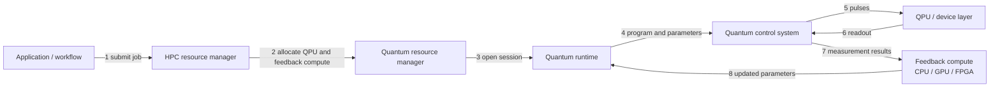
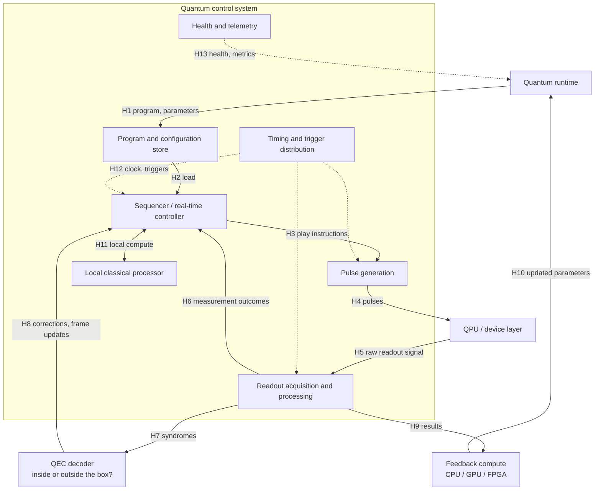

# UC-XX — Use-case title

<!--
HOW TO USE THIS CARD
* Copy this file to use-cases/UC-XX-short-name.md.
* Part A is for everyone. It needs no quantum-control expertise: describe the scenario
  in plain language and draw the Level 1 diagram with the control system as one box.
* Part B opens the control-system box. Fill in what you know. Anything you can't answer,
  mark "Unknown" and add a question to C1 so a control expert can pick it up.
* "Unknown" is a valid answer. A question nobody in the group can answer is a finding
  for the white paper, not a failure of the card.
* Prefer orders of magnitude to exact numbers. Milestone 1 does not require precise values.
* These guidance comments don't show on the rendered page. Delete them when you're done.
-->

| Field | Value |
|---|---|
| Status | Draft / In review / Accepted |
| WG relevance | Primary / Adjacent / Context |
| Timing regime | *Fill in after A9* |
| Fault-tolerance assumption | Requires FTQC / Hybrid, no full fault tolerance / Either |
| Qubit modality | Modality-agnostic / Specific to: ___ |
| Owner (Part A) | |
| Control expert (Part B) | |
| Reviewer | |
| Last updated | YYYY-MM-DD |

---

# Part A — The scenario (anyone)

## A1. Scenario

<!-- 3–5 sentences, told as a story: who wants to do what, on what kind of system, and what happens. Avoid jargon where you can. -->

## A2. Why it matters

<!-- Who benefits? What becomes slow, expensive, or impossible if this isn't supported well? -->

## A3. What this use case adds

Tick everything that applies. A use case is retained if it adds at least one requirement or boundary the others don't.

- [ ] A timing requirement no other use case has
- [ ] A distinct data-movement pattern or data volume
- [ ] A distinct scheduling or co-allocation need
- [ ] A synchronization need across components or QPUs
- [ ] An instruction-safety need (protecting the device from harmful programs)
- [ ] A scale need (qubits, QPUs, concurrent users, program size)
- [ ] An interface boundary the other use cases miss

In one sentence, what is the most distinctive thing about this use case?

## A4. Scope checks

These reflect the Meeting 1 decisions. If a box can't be ticked, say why in a sentence. The use case may still be useful as Context rather than Primary.

- [ ] Runs on-premises (cloud access models are out of scope)
- [ ] Any real-time feedback or decoding compute sits next to the QPU
- [ ] If more than one QPU is involved, the control stack manages entanglement between them (multi-QPU work without entanglement belongs to higher-level scheduling)

## A5. Actors and logical components

Mark each role Yes, No, or ? and say what it does here. A single product can play several roles.

| Logical role | Plain-language description | Involved? | What it does in this use case |
|---|---|---|---|
| Application | The user's program or algorithm | | |
| Workflow / orchestration | Coordinates steps across CPU, GPU, and QPU tasks | | |
| HPC resource manager | Allocates classical nodes (e.g. Slurm) | | |
| Quantum resource manager | Allocates and tracks QPU access | | |
| Quantum runtime | Runs quantum programs and manages sessions | | |
| Quantum control system | Electronics that turn programs into pulses and readout signals into data | | |
| QPU / device layer | The qubits and their immediate hardware | | |
| Feedback compute | CPU, GPU, or FPGA processing results during execution | | |
| QEC decoder | Turns error syndromes into corrections | | |
| Other: ___ | | | |

## A6. Trigger and preconditions

**What starts it?**

**What must already be true?** <!-- e.g. device calibrated, resources reserved, program compiled and loaded -->

## A7. Nominal flow

<!-- One line per step: who does what, and sends what to whom. These step numbers become the arrow labels in A8. -->

1.
2.
3.

## A8. Information flow, Level 1

The control system stays as a single box here. Delete the nodes and arrows that don't apply, add what's missing, and renumber the arrows to match A7.

## A9. How fast does it need to be?

**When a result comes back, how soon must it be used?** Tick the tightest case that applies.

- [ ] Inside the same shot, while the qubits are still in use (e.g. mid-circuit feedback, QEC corrections)
- [ ] Between shots of the same program
- [ ] Between programs in the same session (e.g. the next iteration of an optimizer)
- [ ] Between separate jobs, or later
- [ ] Not sure

**Rough deadline, if known:** < 1 µs / 1 µs–1 ms / 1 ms–1 s / > 1 s / Unknown

**What sets that deadline?** <!-- e.g. qubit coherence, QEC cycle time, time per optimizer iteration, queue wait -->

<!-- The group will map these answers onto timing-regime terms (real-time, near-time, ...) once terminology is aligned with the System Architecture WG. Then fill in "Timing regime" in the header table. -->

## A10. Relationship to SC26

- [ ] Demonstrated at SC26
- [ ] Partially exercised at SC26
- [ ] Architecturally represented but not exercised
- [ ] Outside the SC26 implementation

Notes:

---

# Part B — Inside the control stack (with a control expert)

## B1. Information flow, Level 2

This opens the control-system box. The blocks are a **vendor-neutral straw man of functions, not hardware**. Any of them may be an FPGA, an embedded CPU, an ASIC, or a co-scheduled HPC node. Rename, merge, or delete blocks to match the scenario, and label every arrow with a hop ID that matches the B2 table.

<!--
Notes on the straw man:
* Whether the QEC decoder belongs inside the control system is an open question from Meeting 1. Draw it where it sits in your scenario.
* Real-time feedback compute may write directly into the control system (IF-G) rather than going back through the runtime (IF-F). Draw the path your scenario actually uses.
* Hops inside the box are internal vendor implementation and won't be standardized, but their time still counts toward the end-to-end loop in B3.
-->

## B2. Boundary crossings

One row per arrow in B1. The rows below match the straw-man hops; delete or add rows to match your diagram.

| Hop | From → To | Interface | What crosses | Size × rate | Latency | Status | Source |
|---|---|---|---|---|---|---|---|
| H1 | Runtime → Program store | IF-E | | | | TBD | |
| H2 | Program store → Sequencer | Internal | | | | TBD | |
| H3 | Sequencer → Pulse generation | Internal | | | | TBD | |
| H4 | Pulse generation → QPU | IF-H (landscape only) | | | | TBD | |
| H5 | QPU → Readout acquisition | IF-H (landscape only) | | | | TBD | |
| H6 | Readout acquisition → Sequencer | Internal | | | | TBD | |
| H7 | Readout acquisition → QEC decoder | IF-G or internal | | | | TBD | |
| H8 | QEC decoder → Sequencer | IF-G or internal | | | | TBD | |
| H9 | Readout acquisition → Feedback compute | IF-G | | | | TBD | |
| H10 | Feedback compute → Runtime | IF-F | | | | TBD | |
| H11 | Sequencer ↔ Local processor | Internal | | | | TBD | |
| H12 | Timing distribution → modules | IF-J | | | | TBD | |
| H13 | Telemetry → Runtime | IF-I | | | | TBD | |

<!--
Column guide:
* What crosses: content and format if known (e.g. "one bit per qubit per measurement", "binary waveform tables", "JSON status messages").
* Size × rate: e.g. "~1 kB per shot × 10^4 shots/s". Orders of magnitude are fine.
* Latency: < 1 µs / 1 µs–1 ms / 1 ms–1 s / > 1 s / Unknown.
* Status: Required (the use case fails without it), Target (desired), Observed (measured on a real system), or TBD.
* Source: where the number comes from (measurement, paper, vendor datasheet, estimate, or a person's name).
-->

## B3. Critical loops

A loop is a chain of hops that must finish before a deadline, e.g. readout → decoder → correction applied. List each one.

| Loop | Hops | Deadline | What sets the deadline | Current estimate | Status |
|---|---|---|---|---|---|
| | e.g. H5 → H7 → H8 → H3 | | | | TBD |

## B4. Requirements drivers

| Dimension | Draft requirement | Status | Evidence |
|---|---|---|---|
| Latency | | TBD | |
| Jitter | | TBD | |
| Bandwidth / data volume | | TBD | |
| Program size | | TBD | |
| Synchronization | | TBD | |
| Determinism | | TBD | |
| Scale (qubits, QPUs, concurrent sessions) | | TBD | |
| Instruction safety | | TBD | |
| Failure behavior | | TBD | |
| Observability / telemetry | | TBD | |

<!-- Security and tenancy beyond basic instruction safety are out of scope for Milestone 1 (Meeting 1 decision). Note them in C2 if they come up. -->

## B5. Interfaces exercised

| Interface | Boundary | Used? | Role in this use case |
|---|---|---|---|
| IF-A | Application ↔ Workflow/orchestration | | |
| IF-B | Workflow/orchestration ↔ HPC resource manager | | |
| IF-C | HPC resource manager ↔ Quantum resource manager | | |
| IF-D | Quantum resource manager ↔ Quantum runtime | | |
| IF-E | Quantum runtime ↔ Control system | | |
| IF-F | Classical accelerator ↔ Quantum runtime | | |
| IF-G | Classical accelerator ↔ Control system | | |
| IF-H | Control system ↔ QPU/device layer | | |
| IF-I | Telemetry/observability across layers | | |
| IF-J | Time and synchronization across layers | | |
| New? | Name the boundary (e.g. compiler ↔ control system) | | |

## B6. Failure and edge cases

<!-- Prompts: What happens if a deadline in B3 is missed? If a component fails mid-run? What does the user see? Can the run recover, or must the job restart? Could a user's program damage the device? -->

---

# Part C — Open items

## C1. Questions for a control expert or vendor

If you couldn't answer something above, write the question here instead.

| Question | Section | Asked to | Answer | Status |
|---|---|---|---|---|
| | | | | Open |

## C2. Interoperability questions

<!-- What would need to be agreed between vendors for this use case to work across different stacks? -->

## C3. Evidence required

<!-- Which measurement, publication, or vendor input would turn a TBD above into Observed or Required? -->

## C4. Open decisions

| Decision | Options | Owner | Needed by |
|---|---|---|---|
| | | | |
